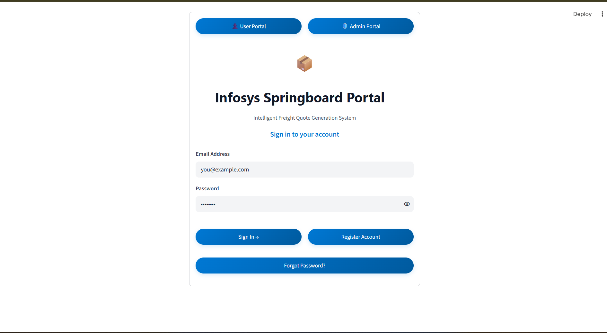
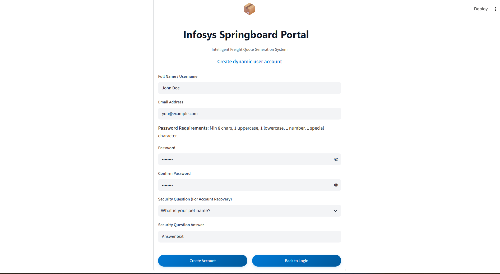
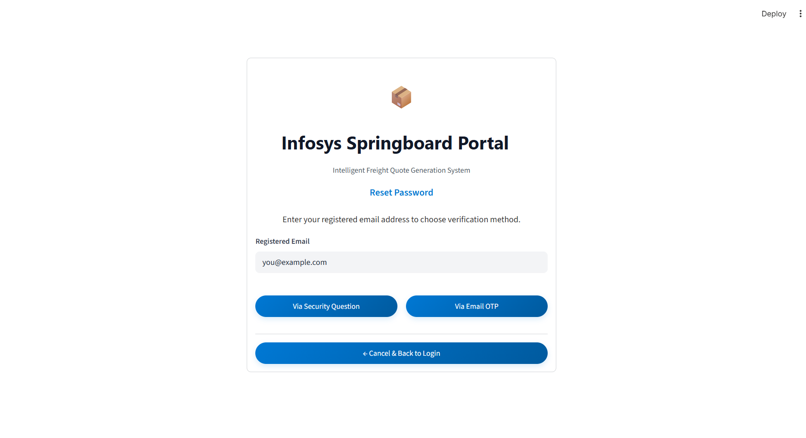
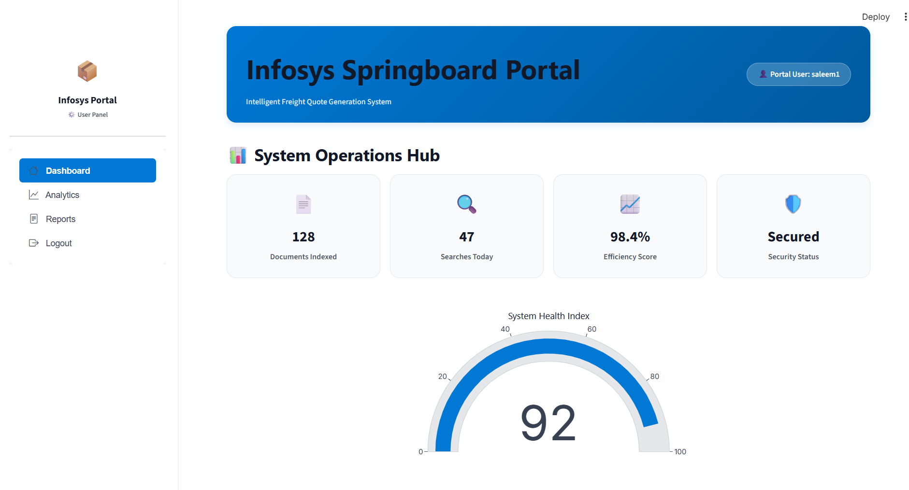
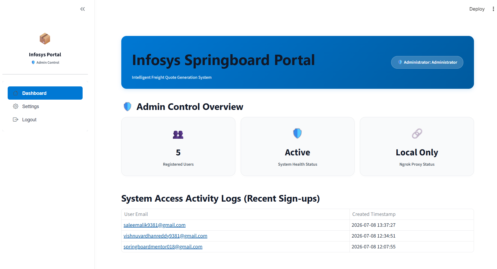

# Infosys Springboard Portal: Intelligent Freight Quote Generation System

Welcome to the **Infosys Springboard Portal**, an intelligent platform engineered to authenticate users, manage admin operations, and showcase advanced logistics analytics metrics for the *Intelligent Freight Quote Generation System* (Virtual Internship 7.0 - Milestone 1).

This system is built using a secure, responsive, and visual Python web stack powered by Streamlit, SQLite, bcrypt password hashing, and signed JWT authentication tokens.

---

## 🚀 Project Overview

The Infosys Springboard Portal serves as a unified entry point for logistics administrators and portal clients. It provides secure portal access via login credentials or two-factor password recovery (via security questions or time-limited dynamic Gmail OTPs). The platform is divided into:
- **Client Analytics Hub**: For viewing active freight quote volumes by route, average transit times, documents indexed, system health stats, and detailed freight ledgers.
- **Admin Control Desk**: A secure configuration portal for viewing all registered users and managing system access logs without ever exposing security details like password hashes.

---

## 🎨 Technologies Used

- **Web Framework**: [Streamlit](https://streamlit.io/) (for building responsive, secure Python web apps)
- **Database Engine**: [SQLite3](https://www.sqlite.org/) (relational local database storage)
- **Cryptography & Security**:
  - `bcrypt` (salted password hashing)
  - `PyJWT` (JSON Web Token signing for sessions and recovery verification)
- **Data Visualizations**: `Plotly` (for responsive gauge, line, and bar charts)
- **Styling**: Modern HTML5/CSS3 custom variables (Segoe UI, Inter fonts, blue accent theme, soft rounded cards)
- **Development Proxy**: `pyngrok` (for secure public URL tunnels in Google Colab)

---

## 📁 Folder Structure

```
Milestone1/
│
├── app.py          # Primary application logic, SQLite database mappings, UI pages, and routing
├── config.py       # Central configuration management loading values from environment/dot-env
└── README.md       # Professional platform documentation (this file)
```

---

## 🔐 Environment Variables

The application reads all configurations and secrets strictly from the environment to avoid hardcoding credentials:

| Environment Variable | Description |
| :--- | :--- |
| `JWT_SECRET` | Secret key used to sign and verify session JWTs and OTP tokens. |
| `EMAIL_ADDRESS` | The Gmail address used to dispatch OTP recovery emails. |
| `EMAIL_PASSWORD` | The Gmail App Password corresponding to the SMTP email address. |
| `NGROK_AUTHTOKEN` | Auth token from your ngrok dashboard for public deployment proxies. |

---

## ⚙️ Installation & Local Setup

### 1. Prerequisites
Ensure you have Python 3.10+ installed.

### 2. Clone and Initialize Configuration
In the workspace root directory, create a `.env` file containing your configurations:
```ini
JWT_SECRET=your-custom-secure-jwt-secret-key
EMAIL_ADDRESS=your-gmail-address@gmail.com
EMAIL_PASSWORD=your-gmail-app-password
NGROK_AUTHTOKEN=your-ngrok-authtoken
```

### 3. Install Dependencies
Run the following command to install python packages:
```bash
pip install streamlit streamlit-option-menu pyjwt bcrypt plotly pyngrok python-dotenv
```

### 4. Running the Application locally
Change your terminal directory into `Milestone1` and start the Streamlit server:
```bash
cd Milestone1
python -m streamlit run app.py
```
Open your browser and navigate to `http://localhost:8501`.

---

## 🐍 Google Colab Setup (Ngrok Proxy Tunnel)

If running inside a Google Colab notebook, you can expose the portal using Ngrok:

1. Add your `NGROK_AUTHTOKEN` and other secrets to the Google Colab **Secrets** tab (the key icon in the left menu).
2. Install dependencies:
   ```python
   !pip install -q streamlit streamlit-option-menu pyjwt bcrypt plotly pyngrok python-dotenv
   ```
3. Run the Streamlit application in the background:
   ```python
   import subprocess
   import os
   # Export Colab secrets to environment variables
   # Start Streamlit server:
   process = subprocess.Popen(["streamlit", "run", "Milestone1/app.py", "--server.port", "8501"])
   ```
4. The application will read `NGROK_AUTHTOKEN` from the environment, connect via `pyngrok`, and display the public link in the Streamlit logs or the side panel.

---

## 💡 Key Architectural Details

### How JWT Authentication Works
When a user logs in (either client or admin), the system generates a signed JSON Web Token (JWT) using `jwt.encode` with an expiration time of 2 hours. This token is saved in `st.session_state.token`. On every script redraw, the token is verified. If the signature is invalid or has expired, the session is invalidated, and the user is redirected to the sign-in screen.

### How OTP Recovery Works
1. When requesting email verification, the system generates a random 6-digit number.
2. It packs the OTP hash and user email into a state JWT token (`st.session_state.otp_jwt_token`) set to expire in exactly 5 minutes.
3. An RFC-compliant professional email containing the code is sent via smtplib to the user's inbox.
4. If SMTP credentials are not set, a warning is printed, and the portal runs in **Developer Sandbox Mode**, displaying the OTP code on-screen so functional testing is never blocked.
5. Clicking **Resend Code** triggers the flow again, invalidating previous signatures and generating a new code.

### Admin Operations
- Accessible via a dedicated Admin Login tab.
- Admin credentials are config-driven and do not allow signup.
- Settings menu displays user directory listings detailing ID, Username, Email, and Created Date. Passwords and password hashes are strictly omitted from UI display directories.

---

## 📷 Screenshots

### Login Page


### Signup Page


### Forgot Password - Security Question


### Forgot Password - OTP


### OTP Email


### User Dashboard


### Admin Dashboard

